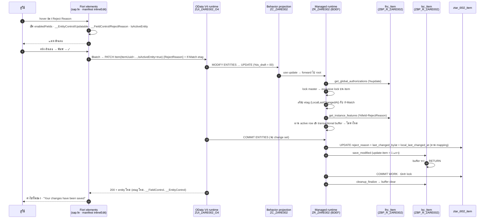

# ZARE002 — Flow: แก้ Reject Reason ในตารางแล้วบันทึก วิ่งผ่าน RAP ตรงไหนบ้าง

> เขียน 2026-09-16 หลังทดสอบบน launchpad จริง · ขั้นที่มี ✅ = เห็นผลจริงบน tenant นี้
> ขั้นที่มี 📖 = อธิบายจากลำดับมาตรฐานของ RAP managed runtime (ไม่ได้ trace ทีละ method บน tenant)

## 0. ภาพรวมใน 1 ประโยค

inline edit ของ Fiori elements **PATCH ไปที่ active instance ตรง ๆ** → RAP managed runtime รับผ่าน
projection `ZC_ZARE002` → root `ZR_ZARE002` → เช็คสิทธิ์ / lock / feature control ใน `lhc_Item`
→ save phase เขียน `ztar_i002_item` ให้เอง → เรียก `lsc_Item` เพิ่ม (ซึ่งไม่ทำอะไรในเคสนี้)
→ ตอบ 200 กลับ · **draft table ไม่ถูกแตะ ไม่มี Edit / Activate เกิดขึ้น**

## 1. ฝั่ง Fiori elements — ก่อนจะยิงอะไรมา backend

| # | เกิดอะไร | object / setting ที่เกี่ยว | หลักฐาน |
|---|---|---|---|
| 1.1 | ตาราง List Report โหลดแถว: FE ยิง `GET Item?$select=…` โดย `autoExpandSelect` เติม `__EntityControl`, `__FieldControl`, `IsActiveEntity`, `HasDraftEntity`, `LocalLastChangedAt` ให้เองเพราะ annotation อ้างถึง | `manifest.json` → `models[""].settings.autoExpandSelect: true` · `$metadata`: `Common.FieldControl Path="__FieldControl/RejectReason"` · `Capabilities.UpdateRestrictions Updatable Path="__EntityControl/Updatable"` | ✅ ยิง `$select=__EntityControl,__FieldControl` เองแล้วได้ `Updatable: true`, `RejectReason: 3` |
| 1.2 | hover ช่อง → FE ตัดสินว่าแก้ได้เมื่อครบ 4 ข้อ: field อยู่ใน `inlineEdit.enabledFields` · `__EntityControl/Updatable = true` · `__FieldControl/RejectReason ≠ 1` · แถวเป็น active และไม่มี draft (`HasDraftEntity = false`) → วาดเส้นใต้ + ดินสอ | `manifest.json` → `routing.targets.ItemList.options.settings.inlineEdit.enabledFields: ["RejectReason"]` | ✅ ดินสอโผล่หลังตัด `@UI.multiLineText` · ก่อนตัดไม่โผล่เพราะ FE render ช่องเป็น `ExpandableText` ไม่ใช่ `Field` ที่ inline edit จับ |
| 1.3 | คลิกดินสอ → ช่องกลายเป็น `sap.m.Input` · พิมพ์ · กด ✓ หรือ Enter | FE ภายใน | ✅ |
| 1.4 | FE สร้าง `$batch` 1 change set: **`PATCH …/Item(ItemUuid=<guid>,IsActiveEntity=true)`** body `{"RejectReason":"…"}` header `If-Match: <ค่า LocalLastChangedAt เดิม>` · ไม่มี `Edit` ไม่มี `Activate` ในนั้น | endpoint `/sap/opu/odata4/sap/zui_zare002_o4/srvd/sap/zui_zare002/0001/` | 📖 ตามเอกสาร inline edit *"the active version is patched directly, no draft is created"* · **ดูเองได้**: F12 → Network → `$batch` → Request payload |

## 2. OData runtime → RAP — จาก HTTP เป็น EML

| # | เกิดอะไร | object | หลักฐาน |
|---|---|---|---|
| 2.1 | service binding รับ PATCH → runtime แปลงเป็น EML ภายใน: `MODIFY ENTITIES OF zc_zare002 ENTITY Item UPDATE FIELDS ( RejectReason ) WITH … %is_draft = 00` | `ZUI_ZARE002_O4` (binding) → `ZUI_ZARE002` (service def `expose ZC_ZARE002 as Item`) | 📖 |
| 2.2 | etag: runtime เทียบ `If-Match` กับ `LocalLastChangedAt` ของ row บน DB · ถ้ามีคนแก้ item เดิมไปก่อน → **412 Precondition Failed** ไม่แตะอะไร | BDEF: `etag master LocalLastChangedAt` | 📖 (ทดสอบ 2 user ยังไม่ได้ทำ — 7.8) |
| 2.3 | **behavior projection** รับ update: `use update;` → ส่งต่อ root · ไม่มี `ZBP_C_ZARE002` เพราะไม่มี logic ชั้น projection | `ZC_ZARE002` (`.bdef` projection) | 📖 |

## 3. Interaction phase บน root BO — ทุกอย่างอยู่ใน buffer ยังไม่แตะ DB

| # | เกิดอะไร | object · method | หลักฐาน |
|---|---|---|---|
| 3.1 | **สิทธิ์ระดับ BO**: runtime ถามว่า user ทำ `%update` ได้ไหม | `lhc_Item->get_global_authorizations` → `result-%update = auth-allowed` | ✅ (ถ้าไม่ allow จะได้ 403 ตั้งแต่ตรงนี้) · ไม่มี instance authorization เพราะ BDEF เป็น `( global )` |
| 3.2 | **Lock**: `lock master` ในBO แบบ managed → runtime ตั้ง exclusive lock บน item ให้เอง ไม่มี method ของเรา | BDEF `lock master` | 📖 |
| 3.3 | **Static field control**: `RejectReason` **ไม่อยู่**ใน `field ( readonly )` → ผ่าน · ถ้า PATCH field อื่น (เช่น `CustomerCode`) จะถูกปฏิเสธตรงนี้ | BDEF `field ( readonly ) …` | 📖 |
| 3.4 | **Dynamic field control**: runtime เรียก `get_instance_features` สำหรับ key ที่ถูกแก้ · method อ่าน `PaymentUuid` ผ่าน `READ ENTITIES … IN LOCAL MODE` → `read_rejected_payments` → `SELECT … FROM zi_zare002_pymt WHERE Status = 'R'` → ถ้า payment ยังไม่ `R` คืน `%field-RejectReason = fc-f-unrestricted` | `lhc_Item->get_instance_features` · `lhc_Item->read_rejected_payments` · CDS `ZI_ZARE002_PYMT` | ✅ ทางอ้อม: หลัง Reject ช่องกลายเป็น readonly จริง = method นี้ถูกเรียกและมีผล |
| 3.5 | runtime อ่าน active row จาก `ztar_i002_item` ผ่าน `ZR_ZARE002` เข้า transactional buffer → ใส่ `RejectReason` ค่าใหม่ทับ · `%control-RejectReason = on` field อื่นไม่ถูกแตะ | CDS `ZR_ZARE002` → `ZI_ZARE002_ITEM` → table | 📖 |
| 3.6 | Determination / validation: **ไม่มี**ใน BDEF → ข้าม | — | ✅ (BDEF ไม่มี `determination` / `validation`) |
| 3.7 | **draft**: เพราะเป็น update บน active โดยตรง runtime **ไม่สร้าง draft** `ztar_e002_item_d` ไม่ถูกเขียน · `Edit` / `Prepare` / `Activate` ไม่ถูกเรียก | draft table `ZTAR_E002_ITEM_D` | 📖 + ✅ ทางอ้อม: filter "Editing Status = Own Draft" หลังบันทึกไม่มีแถวโผล่ · **ยืนยันตรงได้**: Data Preview `ztar_e002_item_d` ต้องไม่มี row ของ item นั้น |

## 4. Save phase — `COMMIT ENTITIES` ตอนจบ change set

| # | เกิดอะไร | object · method | หลักฐาน |
|---|---|---|---|
| 4.1 | `finalize` · `check_before_save` — managed ทั้งคู่ ไม่มี validation on save ของเรา → ผ่าน | runtime | 📖 |
| 4.2 | **managed save**: runtime แปลง buffer → `UPDATE ztar_i002_item` ตาม `mapping for ztar_i002_item { RejectReason = reject_reason; … }` · พร้อมเติม admin field จาก annotation ใน `ZI_ZARE002_ITEM`: `last_changed_by` (`@Semantics.user.lastChangedBy`) · `last_changed_at` (`@Semantics.systemDateTime.lastChangedAt`) · `local_last_changed_at` (`localInstanceLastChangedAt`) → **etag เปลี่ยน** | BDEF `persistent table ztar_i002_item` + `mapping` · CDS `ZI_ZARE002_ITEM` annotations | ✅ reload แล้วค่ายังอยู่ · Data Preview `ztar_i002_item.reject_reason` มีค่า |
| 4.3 | **additional save**: runtime เรียก saver ต่อ พร้อม `update-item` = 1 แถวที่เปลี่ยน · code เราเรียก `zcl_zare002_status_buffer=>get_all( )` → **ว่าง** (ไม่มีใครกด Reject) → `RETURN` ไม่แตะ `ztar_i002_pymt` | BDEF `with additional save` · `lsc_Item->save_modified` · `ZCL_ZARE002_STATUS_BUFFER` | 📖 (saver ถูกเรียกแน่ — พิสูจน์แล้วตอนกด Reject ที่ `status = R` ลง DB) |
| 4.4 | `COMMIT WORK` โดย runtime · ปลด lock | runtime | 📖 |
| 4.5 | `cleanup` (managed) → `lsc_Item->cleanup_finalize` → `zcl_zare002_status_buffer=>clear( )` | `lsc_Item->cleanup_finalize` | 📖 |

## 5. ขากลับ

| # | เกิดอะไร | หลักฐาน |
|---|---|---|
| 5.1 | runtime อ่าน entity ใหม่ผ่าน `ZC_ZARE002` (รวม path `_Payment.*`, `_BusinessPartner.CustomerName`, `__FieldControl`, `__EntityControl`, etag ใหม่) ตอบ **200** ใน `$batch` | ✅ ค่าใหม่โชว์ทันทีโดยไม่ reload |
| 5.2 | FE อัปเดตแถวใน table จาก response · ช่องกลับเป็น text · toast "Your changes have been saved" | ✅ |

## 6. สิ่งที่**ไม่**อยู่ใน flow นี้ — ที่มักเข้าใจผิด

| ไม่เกิด | เพราะ |
|---|---|
| `draft action Edit` / `Activate` / `Prepare` | inline edit PATCH active ตรง · draft action ถูกใช้เฉพาะตอน FE ทำ mass edit หรือ object page |
| เขียน `ZTAR_E002_ITEM_D` | เหตุผลเดียวกัน · แต่ BDEF ยังต้องมี `with draft` เพราะ **FE เปิด inline edit ให้เฉพาะ draft-enabled service** |
| `rejectItem` / `submitItem` | เป็น action คนละเส้นทาง เกิดเมื่อกดปุ่มเท่านั้น |
| `ZCL_ZARE002_STATUS_BUFFER=>add` | มีแต่ `rejectItem` ที่เรียก · save ธรรมดา buffer ว่างเสมอ |
| เขียน `ztar_i002_pymt` | header ถูกเขียนเฉพาะจาก saver เมื่อ buffer มีของ = เฉพาะตอน Reject |
| `ZI_ZARE002_BP` / `I_BusinessPartner` | ถูกอ่านตอน 5.1 เพื่อคืน `CustomerName` เท่านั้น ไม่เกี่ยวกับการเขียน |

## 7. เทียบกับตอนกด Reject — ต่างกันตรงไหน

| | แก้ Reject Reason (inline edit) | กด Reject |
|---|---|---|
| HTTP | `PATCH Item(…)` | `POST Item(…)/…rejectItem` ใน change set (ทุกแถวที่ติ๊ก) |
| entry point ใน pool | ไม่มี — managed update | `lhc_Item->rejectItem` |
| field control | `get_instance_features` เช็คก่อน update | `get_instance_features` เช็ค `%action-rejectItem` ก่อน (ปุ่ม dim) |
| เขียน item | runtime เขียน `reject_reason` + admin | `rejectItem` `MODIFY ENTITIES UPDATE RejectReason` ค่าเดิม (บังคับ save phase) |
| buffer | ว่าง | `add( payment_uuid, 'R' )` |
| saver | `save_modified` RETURN | `save_modified` → `UPDATE ztar_i002_pymt SET status = 'R'` |
| draft | ไม่แตะ | ไม่แตะ |

## 8. ดูของจริงเองบน tenant (5 นาที)

1. F12 → **Network** → filter `$batch` → แก้ช่อง 1 แถว → ✓ → คลิก request `$batch` ล่าสุด → **Payload**: เห็น `PATCH …Item(ItemUuid=…,IsActiveEntity=true)` + `If-Match` · **Response**: เห็น `200` + JSON entity ที่ `LocalLastChangedAt` เปลี่ยน
2. ADT → Data Preview `ztar_i002_item` where `item_uuid = <guid นั้น>` → `reject_reason` ค่าใหม่ · `last_changed_by` = user พี่ · `local_last_changed_at` = เมื่อกี้
3. ADT → Data Preview `ztar_e002_item_d` where `itemuuid = <guid นั้น>` → **ไม่มี row** = ยืนยันข้อ 3.7 ว่าไม่มี draft
4. อยากเห็น `get_instance_features` ถูกเรียกจริง: ตั้ง breakpoint ใน ADT ที่ method นั้น (external breakpoint สำหรับ user ของพี่) แล้วแก้ช่อง — จะหยุดก่อน update
